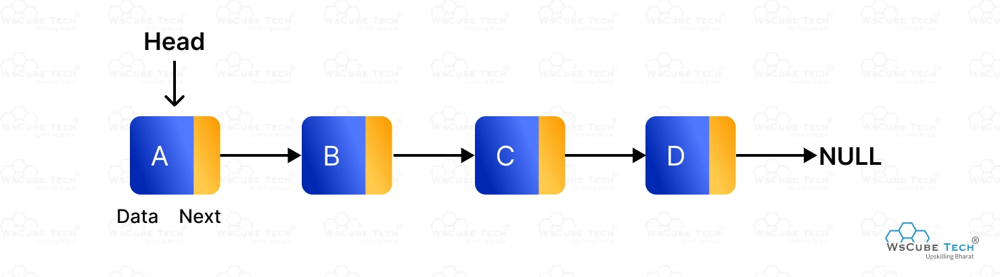
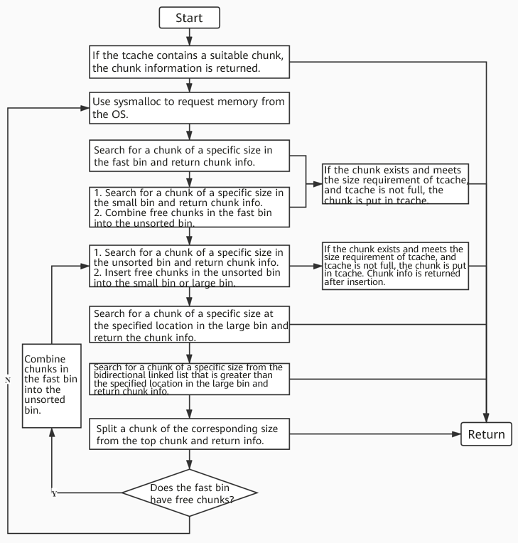

## Overview

The heap is composed of chunks, structures that contains a fixed amount of metadata and a variable (depends on the chunk lenght that is requested as an input to `malloc()` or `calloc()`) amount of user Data. I'll try to explain how the heap works by break down it's mechanism and components into multiple subchapters. One fundamental component of the heap is the *Allocator*

!!! Allocator
    A heap allocator is a system component that manages a program's dynamic memory by reserving chunks of memory (such as malloc in C or Box/Vec in Rust) and reclaiming them later. It functions as a bookkeeper, tracking free space to minimize fragmentation and prevent memory leaks.

# Chunks

A chunk is a portion of memory on the heap, and an user usually interact with it through a pointer that has been returned by malloc. Every chunk must be freed when it's not longer used and the pointer that referred to the previous allocated chunk should be set to null in order to avoid a UAF (Use After Free).

At level code a chunk is always declared as a `malloc_chunk` and it's field are always the same, but their usage depends on the state of the chunk.

```
struct malloc_chunk {
  INTERNAL_SIZE_T      mchunk_prev_size;  // Size of prev chunk if free
  INTERNAL_SIZE_T      mchunk_size;       // Size in bytes + flags
  struct malloc_chunk* fd;                // Forward pointer
  struct malloc_chunk* bk;                // Backward pointer
  struct malloc_chunk* fd_nextsize;       // Forward pointer for large bins
  struct malloc_chunk* bk_nextsize;       // Backward pointer for large bins
};
```

# Top Chunk

The top chunk is the chunk that is located at the end of the heap. The top chunk is where the memory for `malloc()` is allocated from if there are no bins of the correct size with at least one freed chunk.
The portion of memory that is still present as freed after a malloc() that took the top chunk memory is called the *remainder chunk*, which is the new top chunk. The top chunk resides at the highest address of the memory (toward the stack).


# Metadata

- **Prev. Size**: Is valid only if the previous chunk has been freed. Otherwise this 8  byte space (on 64 bit systems) is taken by the previous chunk to write part of it's user data. This is useful for various purposes. In the first case, the previous chunk has been freed, so the allocator (which manages the chunks) can use this field to perform memory coalescing (merging adjacent free chunks into a larger block) much more quickly.

- **Size**: This is the overall (data + metadata) size of the chunk. It must be a multiple of 8 meaning that the last 3 bits of the size are 0. This allows to save spaces by putting 3 flags into this field (last three bits):

    - **A** is the NON_MAIN_ARENA flag that is set to 1 if the current chunk is not located into the main arena. I will dig into arenas later.

    - **M** is the IS_MMAPED flag and is set to 1 if the chunk is allocated via mmap() rather than malloc(). This means that the chunk was directly created by the OS rather than being taken by the heap. When freed this chunk will be not placed into *bins*, instead a munmap() wil be performed to give the memory back to the OS. Those chunks do not have adjacent chunks, therefore they will ignore A,P flags.

    - **P** is the PREV_INUSE flag which is set when the previous adjacent chunk is in use. The very first chunk allocated has always this bit set to 1 to prevent access to non owned memory. If it's set to 1 it's impossible to retrieve the previous chunk size.

We must distinguish from freed chunks and allocated chunks:

- *An allocated chunk looks like this:*
    ```
        chunk-> +-+-+-+-+-+-+-+-+-+-+-+-+-+-+-+-+-+-+-+-+-+-+-+-+-+-+-+-+-+-+-+-+
            |             Size of previous chunk, if unallocated (P clear)  |
            +-+-+-+-+-+-+-+-+-+-+-+-+-+-+-+-+-+-+-+-+-+-+-+-+-+-+-+-+-+-+-+-+
            |             Size of chunk, in bytes                     |A|M|P|
        mem-> +-+-+-+-+-+-+-+-+-+-+-+-+-+-+-+-+-+-+-+-+-+-+-+-+-+-+-+-+-+-+-+-+
            |             User data starts here...                          .
            .                                                               .
            .             (malloc_usable_size() bytes)                      .
            .                                                               |
    nextchunk-> +-+-+-+-+-+-+-+-+-+-+-+-+-+-+-+-+-+-+-+-+-+-+-+-+-+-+-+-+-+-+-+-+
            |             (size of chunk, but used for application data)    |
            +-+-+-+-+-+-+-+-+-+-+-+-+-+-+-+-+-+-+-+-+-+-+-+-+-+-+-+-+-+-+-+-+
            |             Size of next chunk, in bytes                |A|0|1|
            +-+-+-+-+-+-+-+-+-+-+-+-+-+-+-+-+-+-+-+-+-+-+-+-+-+-+-+-+-+-+-+-+
    ```

- *Free chunks are stored in circular doubly-linked lists, and look like this*:
    ```
        chunk-> +-+-+-+-+-+-+-+-+-+-+-+-+-+-+-+-+-+-+-+-+-+-+-+-+-+-+-+-+-+-+-+-+
            |             Size of previous chunk, if unallocated (P clear)  |
            +-+-+-+-+-+-+-+-+-+-+-+-+-+-+-+-+-+-+-+-+-+-+-+-+-+-+-+-+-+-+-+-+
        `head:' |             Size of chunk, in bytes                     |A|0|P|
        mem-> +-+-+-+-+-+-+-+-+-+-+-+-+-+-+-+-+-+-+-+-+-+-+-+-+-+-+-+-+-+-+-+-+
            |             Forward pointer to next chunk in list             |
            +-+-+-+-+-+-+-+-+-+-+-+-+-+-+-+-+-+-+-+-+-+-+-+-+-+-+-+-+-+-+-+-+
            |             Back pointer to previous chunk in list            |
            +-+-+-+-+-+-+-+-+-+-+-+-+-+-+-+-+-+-+-+-+-+-+-+-+-+-+-+-+-+-+-+-+
            |             Unused space (may be 0 bytes long)                .
            .                                                               .
            .                                                               |
    nextchunk-> +-+-+-+-+-+-+-+-+-+-+-+-+-+-+-+-+-+-+-+-+-+-+-+-+-+-+-+-+-+-+-+-+
        `foot:' |             Size of chunk, in bytes                           |
            +-+-+-+-+-+-+-+-+-+-+-+-+-+-+-+-+-+-+-+-+-+-+-+-+-+-+-+-+-+-+-+-+
            |             Size of next chunk, in bytes                |A|0|0|
            +-+-+-+-+-+-+-+-+-+-+-+-+-+-+-+-+-+-+-+-+-+-+-+-+-+-+-+-+-+-+-+-+
    ```

In order to explain the Fd and Bk pointers we must give an overview of the *bins*.

# Bins

To improve the efficiency of heap memory allocation and release, glibc malloc uses explicit lists to manage freed chunks. An explicit list is a linked list that connects nodes with the same attribute in series to facilitate management. In glibc malloc, these linked lists are called bins. The nodes on the linked lists are freed chunks. We can differentiate bins in how they are used and the min/max size of the chunks that they store. 

It is important to note that the original bins were the small bin, large bin and unsorted bin. Tcache and fastbins were implemented as an optimization above those original bins. So during the analysis of the glibc source code one must differentiate the code from the original bins and those that were added later.

For example this comment from the glibc [malloc source code](https://codebrowser.dev/glibc/glibc/malloc/malloc.c.html#1734) is not true:
`Each bin is doubly linked.`

#### Bins definition

Smallbins, unsorted bin e largebins are loaded inside a struct called main arena:
```
struct malloc_state {
  /* ... */
  mchunkptr bins[NBINS * 2 - 2];
  /* ... */
};
```

This is the struct of the main arena that is statically defined in the data segment (initialized global and local static variables) of libc.so, it is loaded into memory during startup inside `ptmalloc_init()` [Arena source code](https://elixir.bootlin.com/glibc/glibc-2.43.9000/source/malloc/arena.c).

!!! info "Copy On Write"
    The .text of libc.so is loaded one single time in memory and is shared by all the process in a system, but the .data segment is copied for each process so that every process has it's own main_arena. As soon a process modifies it's arena this technique is applied.

`NBINS` is defined as 128. Bin 0 does not exist, bin 1 is the unsorted bin, bins 2-64 are small bins and bins 65-127 are large bins.

The index of a bin based upon the size is found by: 
```
#define bin_index(sz) \
  ((in_smallbin_range (sz)) ? smallbin_index (sz) : largebin_index (sz))
```

A closer look will reveal that the `bins` variable does not load `malloc_chunk` data, but rather `mchunkptr`; this type is defined as a pointer to the base of a `malloc_chunk`.

`typedef struct malloc_chunk* mchunkptr;`

This is because loading a `malloc_chunk` into memory would be too resource-intensive, and the workarounds that have been developed can be found in the glibc comments. 

Without going into details, doubly linked list commonly use a fake node as the first node of the list, this permits to avoid the empty list check. In order to use the same code for all the nodes, the fake node must be a `malloc_chunk`.

The bins will store the first node by masking it as a malloc_chunk node, doing so the first index `bins[0]` is the fd pointer of the unsorted bin and `bins[1]` is the bk pointer of the first fake node of the unsorted bin.

### SmallBins
There are 62 small bins that are structured as a circular doubly linked list (fd and bk are used). The access pattern is FIFO and those bins are consolidated when there is a free().

On 64 bit systems small bins will manage chunks that are less than 1.024 bytes (from that size on chunks are considered large) and the minimum size is 32 to 47 bytes and the chunk size in each subsequent small bin is increased by 16 bytes, that is, the minimum chunk value of the last small bin is 32 + 62 x 16 = 1008 bytes. In 32 bit systems the maximum size of a small bin is 512 bytes.

Each small bin store only one size of a chunk, so they are automatically ordered.

```
 #define in_smallbin_range(sz)  \
  ((unsigned long) (sz) < (unsigned long) MIN_LARGE_SIZE)
```

### LargeBins

Used to manage chunks that are larger than 1024 bytes (on 64 bit systems). There are 63 large bins and they store a *range* of sizes (not a fixed one as in small bins). Those sizes are designed to do not overlap between each others. The largest amount of memory of a large bin covers is above 1 MB. 

Due to their nature, large bins needs ordering.

### Unsorted Bin

All remainders from chunk splits, as well as all returned chunks,
are first placed here. They are then placed in regular bins after malloc gives them ONE chance to be used before binning. 

Basically, the unsorted chunks acts as a queue, with chunks being placed on it in free (and malloc_consolidate), and taken off (to be either used or placed in bins) in malloc (either used as the malloc response or if not placed into the associated bin).

### Fastbins
Fast bins are used to improve the allocation efficiency of small memory. Before thread local caches (tcache) were introduced (later in the note), fast bins were the first structure to be accessed during memory application and release. 

Chunks that are placed into the fastbins will not modify the prev_inuse flag of the adjacent chunk, so from the allocator points those chunk are already in use and cannot be merged.

On a 64-bit system, a fast bin consists of 10 linked lists (10 fastbins), and the maximum chunk size is 160 bytes. 

However, glibc limits the maximum chunk size to 128 bytes by using the global variable `global_max_fast` by default. Therefore, a chunk whose size is *16 to 128* bytes and is a multiple of 16 is classified as a fast chunk by default (Fastbins size goes from 16 bytes to 128 bytes).

The max size is given by: 
`#define MAX_FAST_SIZE  (80 * SIZE_SZ / 4)` where `SIZE_SZ` is defined as `(sizeof(INTERNAL_SIZE_T))` 

Each fast bin maintains a singly linked list as a LIFO structure. To implement the LIFO algorithm, each fast bin element in the fastbins array points to the tail node of the linked list, and the tail node points to the previous node by using its fd pointer.

*Fast bins do not merge free chunks (Not directly)* and *there isn't a fixed max amount of chunks* that a fastbin can take.



We can see the comment on documentation for a better understanding: 
   ```
   /*
    An array of lists holding recently freed small chunks.  Fastbins
    are not doubly linked.  It is faster to single-link them, and
    since chunks are never removed from the middles of these lists,
    double linking is not necessary. Also, unlike regular bins, they
    are not even processed in FIFO order (they use faster LIFO) since
    ordering doesn't much matter in the transient contexts in which
    fastbins are normally used.
    Chunks in fastbins keep their inuse bit set, so they cannot
    be consolidated with other free chunks. malloc_consolidate
    releases all chunks in fastbins and consolidates them with
    other free chunks.*/
   ```

Fastbins are placed in the same struct as other bins but in a different field:
```
struct malloc_state {
  /* ... */

  /* Array of fastbins */
  mfastbinptr fastbinsY[NFASTBINS];

  /* Base of the topmost chunk */
  mchunkptr top;

  /* Normal bins: unsorted, small, large */
  mchunkptr bins[NBINS * 2 - 2];

  /* ... */
};
```

### Tcache (Thread Local Cache)

Introduced in glibc 2.26 as an efficiency improvement for the allocation into multithreading programs. They avoid the necessity of gaining the global lock to the main aren for operation on small block. It basically acts as a Fast bins for each thread, in order to save time avoiding to wait for the lock to the main arena. 

The tcache is a LIFO data structure that points only to the head of the list (*only fd is used*)

!!! Main Arena Lock
    The main arena is the primary contiguos memory region created by the glibc memory allocator to manage a process's heap. A lock is present as a mutex to prevent race condition and memory collision in multithread applications.

There are 64 bins that goes from 24 byte to 1032 bytes, with a distance of 16 bytes between each bin. Every tcache bin has a max amount of 7 chunks that it can store.
If the tcache of a specific dimension is full, the associated fastbin is used (requires lock).

Due to the fact that the tcache needs to be unique to each thread, it is a different struct from malloc_state:

```
/* Single entry in the tcache list */
typedef struct tcache_entry {
  struct tcache_entry *next;
  struct tcache_perthread_struct *key;
} tcache_entry;

/* Main tcache structure per thread */
typedef struct tcache_perthread_struct {
  uint16_t counts[TCACHE_MAX_BINS];
  tcache_entry *entries[TCACHE_MAX_BINS];
} tcache_perthread_struct;

/* Thread-local pointer initialized per thread */
static __thread tcache_perthread_struct *tcache = NULL;
```

#### Bins Summary

### Glibc Heap Bins Summary

| Bin Type | Data Structure | Allocation Policy | Min Chunk Size | Max Chunk Size | Total Bins | Max Elements per Bin |
| :--- | :--- | :--- | :--- | :--- | :--- | :--- |
| **Tcache** | Singly Linked List | LIFO | 32 bytes | 1032 bytes (0x408) | 64 | 7 (default limit) |
| **Fastbins** | Singly Linked List | LIFO | 32 bytes | 128 bytes (0x80) | 10 | Uncapped |
| **Unsorted Bin** | Doubly Linked List | FIFO / Cache | 32 bytes | System limits | 1 | Uncapped |
| **Small Bins** | Doubly Linked List | FIFO | 32 bytes | 1008 bytes (0x3F0) | 62 | Uncapped |
| **Large Bins** | Doubly Linked List | Best-Fit / FIFO | 1024 bytes (0x400) | Below `mmap` threshold | 63 | Uncapped |

# Consolidation

## malloc_consolidate

Fragmentation is a major problem from the heap perspective. The function that merges heap chunks is `malloc_consolidate()` and we can see it as the garbage collector of the heap. It operates exclusively on fastbins and hen called it perform the following operations:

- **For every fastbins chunk* it checks if the chunks adjacent (at lower address) is not in use (so it will check the current chunk prev inuse bit), in that case it merges it.

- It will also check the upper adjacent chunk and, if it's not in use and it's not the top chunk, it will also merge it into a final chunk.


- Those marged block will be placed inside the unsorted bin.

- If the next chunk was the top chunk, the current chunk is driectly merged with it.

I don't want to go in depth for the prev_inuse management, but you can imagine that, based upon the chunks that are merged at the end of this operations, the appropriate prev_inuse flags will be correctly set.

## Immediate consolidation (_int_free)

This consolidation is performed from `free()` every time that a chunk that will not go into tcache or fastbin is freed. It perform the following actions:

- *Backward consolidation*: The `prev_inuse` flag of the chunk that is being freed will be checked. If the adjacent chunk is free a merge is performed.

- *Forward consolidation*: It perform the same operation but with the other adjacent chunk and merge it if it's free.

- The final chunk is going to be placed inside the unsorted bin.

- If the adjacent chunk is the top chunk, the chunk is merged to it.

# WorkFlow

### `malloc(size)`

When an application calls `malloc(size)`, the allocator executes a strict sequence of steps. The search stops as soon as a suitable chunk is found.

1. **Request Normalization:**
   The allocator never looks for the exact size requested by the user. It adds the necessary space for metadata (minimum 8 or 16 bytes) and rounds the result up to respect CPU alignment (multiples of 16 bytes on 64-bit systems). If a user asks for 12 bytes, `malloc` will look for a 32-byte chunk.
   *If the request is abnormally large (e.g., hundreds of Kilobytes), `malloc` bypasses all bins and directly uses `mmap()` to request memory from the kernel.*

2. **Tcache Search:**
   `malloc` calculates the Tcache index corresponding to the requested size. If the Tcache bin has at least one chunk available, it removes it from the head of the list (LIFO), updates the pointers, and returns it to the user. *No arena lock is acquired.*

3. **Fastbins Search:**
   If the Tcache is empty but the size falls within the Fastbins range (default < 128 bytes), `malloc` checks the corresponding Fastbin. If it finds available chunks, it takes one. Furthermore, to optimize future allocations, **it empties the rest of that Fastbin and moves the remaining chunks into the thread's Tcache**, then returns the requested chunk to the user. The displacement is performed from the head of the fastbin and it's stopped if the tcache becomes full. `tcache->counts[tc_idx] < mp_.tcache_count`

4. **Small Bins Search:**
   If the size falls into the Small category (and fast paths failed), the allocator checks the exact associated Small Bin. If it contains a chunk, it is unlinked from the doubly linked list (FIFO) and returned. As in Fastbins Search, the allocator will **empty the rest of that Small Bin and moves the remaining chunks into the thread's Tcache**. 

5. **Consolidation (size >= 1024):**
   If the request is for a *Large* size (>= 1024 bytes), `malloc` knows it will have to perform a complex search. Before doing so, it invokes `malloc_consolidate()` to empty all Fastbins, merge adjacent fragments into the unsorted bin, and place them in the Unsorted Bin, hoping to create a block large enough.

6. **Unsorted Bin :**
   If the previous steps fail, `malloc` starts scanning the Unsorted Bin from start to finish (FIFO):
   - **Exact match:** If it finds a chunk of the perfect size, it returns it immediately.
   - **Partial match (Splitting):** If it finds a chunk *larger* than needed, it splits it. It returns the requested portion to the user and turns the remainder into a new free chunk, which is put back into the Unsorted Bin.
   - **Sorting:** If an inspected chunk does not fit, **it is not left in the Unsorted Bin**. `malloc` unlinks it and inserts it into the appropriate Small Bin or Large Bin. *This is the only time Small and Large Bins are populated.*. If the request was inside the tcache size, the sorting also stash the chunk into the tcache.

7. **Large Bins:**
   If the request was Large, after sorting the Unsorted Bin, `malloc` searches the corresponding Large Bin. Using the `fd_nextsize` and `bk_nextsize` pointers, it skips through the blocks to find the *best fit* (the smallest block that is still large enough). Again, if the found block is too large, it is split, and the remainder goes into the Unsorted Bin.

8. **Extraction from Top Chunk:**
   If all bins fail, the allocator turns to the Top Chunk (the large block of memory at the top of the heap bordering unmapped space). If the Top Chunk is large enough, it slices a piece off and returns it.

9. **OS Request (`sysmalloc`):**
   If even the Top Chunk is exhausted or too small, `malloc` is forced to ask the kernel for new memory. It makes a *syscall* (`sbrk` to expand the Top Chunk, or `mmap` to allocate a completely new area) and finally serves the request.




---

### `free(ptr)`

When the application calls `free(ptr)`, the goal of `glibc` is to reclaim the block as quickly as possible, merging it with other blocks only if strictly necessary to combat fragmentation.

1. **Validation and Sanity Checks:**
   `free` does not trust the passed pointer blindly. It checks that:
   - The pointer is correctly aligned in memory.
   - The chunk does not exceed the physical limits of the arena.
   - The chunk is not the same one returned by an immediately preceding `free` call (basic *Double Free* check).
   - If the chunk has the `IS_MMAPPED` (M) bit set to 1, `free` ignores the heap and directly calls the `munmap()` syscall to return the memory pages to the kernel.

2. **Insertion into Tcache:**
   If the chunk size is compatible with the Tcache and the corresponding bin is not full (< 7 elements):
   - **Security:** A check is performed on the chunk's `key` to detect complex *Double Free* attempts within the same bin.
   - The `fd` pointer is written into the data space to point to the current head of the list.
   - The chunk becomes the new head of the Tcache (LIFO). *The process ends here.*

3. **Insertion into Fastbins:**
   If the Tcache is full or disabled, but the chunk falls within the fastbin threshold (e.g., < 128 bytes):
   - **Security:** It checks that the chunk at the top of the list is not the same one being freed (Partial Double Free protection).
   - The block is inserted at the head of the Fastbin (LIFO).
   - The `PREV_INUSE` bit of the physically next block in memory is *not* altered. To the memory, this chunk still appears allocated, preventing any coalescence. *The process ends here.*

4. **Coalescence in the Unsorted Bin:**
   If the block is larger than the fastbins, it must be placed into the Unsorted Bin. Before doing so, `free` tries to merge it with its physical neighbors to create a larger block:
   - **Backward Coalesce:** It checks its own `PREV_INUSE` flag. If it is `0`, it means the physically previous block is free. `free` reads the `prev_size` field, jumps back to the header of the previous block, unlinks it from its current bin, and merges the two chunks by combining their sizes.
   - **Forward Coalesce:** It checks the state of the physically next block (by reading the header of the chunk after that to see its `PREV_INUSE`). If the next block is free, it merges it too. If the next block is the **Top Chunk**, the chunk being freed is simply merged directly into the Top Chunk and the operation ends (it is not placed in any bin).

5. **Insertion into the Unsorted Bin:**
   If the chunk resulting from the merges (or the original chunk if no merges occurred) does not border the Top Chunk, it is inserted at the beginning of the Unsorted Bin's doubly linked list (FIFO).
   - The `PREV_INUSE` bit of the next chunk is set to `0`.
   - The `prev_size` field of the next chunk is updated with the new size of this free block.

6. **Heap Trimming:**
   If, after a coalescence with the Top Chunk, the total size of the Top Chunk exceeds a certain threshold (typically 128 KB), `free` internally calls `systrim()`. This process attempts to return the excess memory at the top of the heap directly to the operating system via `sbrk` with negative values, lowering the memory footprint of the process.

Sources :

- [OpenEuler](https://www.openeuler.org/en/blog/wangshuo/Glibc_Malloc_Source_Code_Analysis_(1).html)

- (Heap Azeria)[https://azeria-labs.com/heap-exploitation-part-2-glibc-heap-free-bins/]