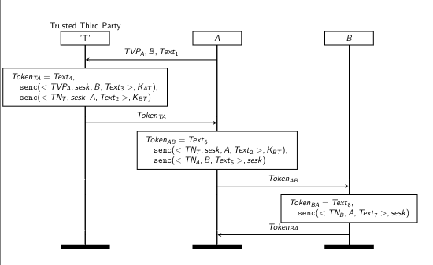
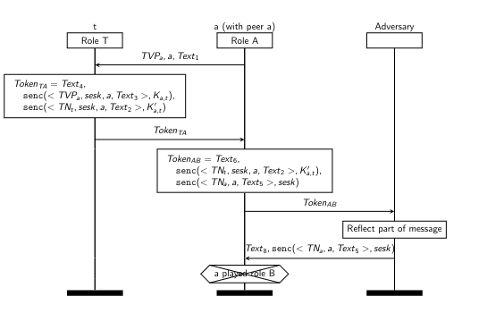

## Simplified Version of the Protocol

Consider an authentication protocol in which two agents, A and B, wish to authenticate themself and enstablish a shared session key with the help of a third party T. Both A and B have a pre-shared session key with T. In the simplified version of the protocol we have:

- A send a message to T which it's identity and the identitity of the other end (B)

- T sends a message to A that contains the random generated shared session key and also the identity of B, this message is encrypted with the shared key between A and T.

- T sends a message to A that contains the random generated shared session key and also the identity of A, this message is encrypted with the shared key between B and T (ticket).

- A will send the latest message receveid to B, this because A should not be able to see what is inside the message.

I will not analyze in details the obvious problems that this protocol has. 

# ISO/IEC Four-Pass Authentication Protocol

As the name indicates, this protocol operates in four distinct execution steps. Note that while every protocol message can optionally contain an application-specific text field, these text fields are omitted from the phases described below for clarity.

### Protocol Phases

#### 1. Phase 1: $A \rightarrow T$
It is assumed from the context that the Trusted Third Party ($T$) already knows the identity of the initiator ($A$). 
* $A$ generates a freshness parameter (a nonce or timestamp $N_A$) and sends a message to $T$ specifying the intended receiver ($B$).
* **Message:** $A, B, N_A$

#### 2. Phase 2: $T \rightarrow A$
$T$ generates a session key ($K_{AB}$) for the communication between $A$ and $B$, and responds with a token composed of two distinct encrypted components:

- **The first component** is encrypted with the long-term shared key between $A$ and $T$ ($K_{AT}$). It contains $A$'s challenge ($N_A$), the identity of $B$, and the newly generated session key $K_{AB}$.

- **The second component** is encrypted with the long-term shared key between $B$ and $T$ ($K_{BT}$). It contains the session key $K_{AB}$, the identity of $A$, and a sequence number (or timestamp).

**Message:** $\{N_A, B, K_{AB}\}_{K_{AT}}, \{K_{AB}, A, \text{Seq}\}_{K_{BT}}$

#### 3. Phase 3: $A \rightarrow B$
$A$ decrypts and verifies the first component received from $T$. Then, $A$ crafts a token to send to $B$ consisting of two parts:

- **The first part** is simply the second component received from $T$ (which $A$ cannot decrypt since it is encrypted under $K_{BT}$).

- **The second part** is a new message encrypted under the freshly acquired session key $K_{AB}$, containing a timestamp $T_A$ and the identity of $B$.

**Message:** $\{K_{AB}, A, \text{Seq}\}_{K_{BT}}, \{T_A, B\}_{K_{AB}}$

#### 4. Phase 4: $B \rightarrow A$
$B$ decrypts the component from $T$ to retrieve the session key $K_{AB}$ and verify $A$'s identity. $B$ then decrypts $A$'s message to verify the freshness ($T_A$). Finally, $B$ responds to $A$ to achieve mutual authentication:

 $B$ sends a timestamp $T_B$ encrypted with the shared session key $K_{AB}$.
* **Message:** $\{T_B\}_{K_{AB}}$



The properties that this protocol needs to hold are:

- Key Secrecy: The session key sesk generated and sent by the key server T to the
    two parties, is not learned by the adversary.

- Authentication for A: the initiator A authenticates the responder B in that if A
    concludes its role of the protocol, believing that it was running it with B, then B
    was running the protocol in the responder role and agreed on the same session key
    sesk.

- Authentication for B: this is dual to the last property, namely when the responder B completes its role with some A, then A was running the protocol as the initiator and again there is agreement on the session key.


## Protocol Formalization

Tamarin documentations provide the followin code as a formalization of the protocol model and security properties:

```
1 theory ISO_IEC
2 begin
3 builtins: symmetric-encryption
4
5 rule Setup: /* Setup shared keys between $X (variable) */
6 [Fr(~kXT)] /* and 'T' (fixed trusted server) */
7 --[]->
8 [!SharedKey($X,'T',~kXT)]
9
10 rule A1: /* A initiates protocol with T */
11 [Fr(~tvpA), Fr(~text1) ]
12 --[]->
13 [Out(<~tvpA,$B,~text1>),StA1($B,~tvpA)]
14
15 rule T: /* T receives message from A and responds to A */
16 let m1 = ~text4
17 m2 = senc(<tvpa,~sesK,B,~text3>,kat)
18 m3 = senc(<~tnT,~sesK,A,~text2>,kbt)
19 tokenTA = <m1,m2,m3>
20 in
21 [In(<tvpa,B,txt1>),
22 !SharedKey(A,T,kat),!SharedKey(B,T,kbt),
23 Fr(~text2),Fr(~text3),Fr(~text4),Fr(~sesK),Fr(~tnT)]
24 --[Sent(A,B,~sesK)]->
25 [Out(tokenTA)]
26
27 rule A2: /* A receives message from T and responds to B */
28 let t2 = senc(<tvpA,sesk,B,text3>,kat)
29 tokenTA = <t1,t2,t3>
30 m1 = ~text6
31 m2 = t3
32 m3 = senc(<~tnA,B,~text5>,sesk)
33 tokenAB = <m1,m2,m3>
34 in
35 [In(tokenTA),!SharedKey(A,T,kat),
36 StA1(B,tvpA),Fr(~text5),Fr(~text6),Fr(~tnA)]
37 --[ALearns(A,B,sesk)]->
38 [Out(tokenAB),StA2(A,B,~tnA,sesk)]
39 rule B: /* B receives message from A and responds to A */
40 let
41 t2 = senc(<tnt,sesk,A,text2>,kbt)
42 t3 = senc(<tna,B,text5>,sesk)
43 tokenAB = <t1,t2,t3>
44 m1 = ~text8
45 m2 = senc(<~tnB,A,~text7>,sesk)
46 tokenBA = <m1,m2>
47 in
48 [In(tokenAB),!SharedKey(B,'T',kbt),
49 Fr(~text7),Fr(~text8),Fr(~tnB)]
50 --[BLearns(A,B,sesk)]->
51 [Out(tokenBA)]
52
53 rule A3: /* A receives response from B */
54 let
55 t2 = senc(<tnb,A,text7>,sesk)
56 tokenBA = <t1,t2>
57 in
58 [In(tokenBA),StA2(A,B,tna,sesk)]
59 --[Done(A,B,sesk)]->
60 []
61
62 lemma secrecy:
63 "All a b k #i. Sent(a,b,k)@i ==> not (Ex #j. K(k)@j)"
64
65 lemma AauthenticatesB:
66 "All a b k #i. Done(a,b,k)@i ==> Ex #j. BLearns(a,b,k)@j"
67
68 lemma BauthenticatesA:
69 "All a b k #i. BLearns(a,b,k)@i ==> Ex #j. ALearns(a,b,k)@j"
70 end
```

The following code is explained in 4 phases:

- Initialization:
    ```
    theory ISO_IEC
    begin
    builtins: symmetric-encryption

    rule Setup: /* Setup shared keys between $X (variable) and 'T' (fixed trusted server) */
        [ Fr(~kXT) ]
    --[]->
        [ !SharedKey($X, 'T', ~kXT) ]
    ```

    builtins: symmetric-encryption is used to load symmetric encryption into the model, it provide the senc(m,k) and sdec(m,k) methods. rule Setup is formed by the Left part that generates a fresh and unique cryptographic value with Fr(). ~: The tilde denotes that this variable is fresh (unique and unpredictable).kXT: The identifier name for the generated variable (typically representing a key between X and T) and this value is stored (persistant fact are noted as !) as a shared key for the variable $X and the trusted fixed entity T. This rule has no action due to missing action inside the ```--[]->``` and we can see an action as the anlogous of labels in labeled transition systems. The setup rule uses a *fresh* fact in left side. Those fact are special because Tamarin can always fire those rule. This means that the setup rule can always be fired to setup symmetric keys between two agents $X and T.

-   T generates session keys:
    ``` 
    rule T: /* T receives message from A and responds to A */
    let m1 = ~text4
      m2 = senc(<tvpa, ~sesK, B, ~text3>, kat)
      m3 = senc(<~tnT, ~sesK, A, ~text2>, kbt)
      tokenTA = <m1, m2, m3>
    in
    [ In(<tvpa, B, txt1>),
      !SharedKey(A, T, kat), !SharedKey(B, T, kbt),
      Fr(~text2), Fr(~text3), Fr(~text4), Fr(~sesK), Fr(~tnT) ]
    --[ Sent(A, B, ~sesK) ]->
    [ Out(tokenTA) ]
    ```
    let ... in is used in rules to bind expression names. In this case we bind to the rule T the name m2, m3 and tokenTA. In() is used to check if there is a tuple of that form in the network. In this case ```In(<tvpa, B, txt1>)``` uses free variables so it will simply check if there is a a message of 3 elements in the network and, if so, bind the values of the messages to the vars of the tuple.
    With the two SharedKey Tamarin will search into the database of facts the long term shared key AT and BT. The latest fact is a fresh fact and generates 5 variables. At the end of this phase, all In() and Fr() fact are eliminated, !SharedKey remain because it's persistant. It is important to note that we must specify SharedKey as persistant (!) otherwise Tamarin will search the facts in the linear (consumable) facts. The action arrow is used to mark an action that we can later use into Lemmas. Out() is used to put a message into the network channel.

- A sends the token to B:
    ```
    rule A2: /* A receives message from T and responds to B */
    let t2 = senc(<tvpA, sesk, B, text3>, kat)
        tokenTA = <t1, t2, t3>
        m1 = ~text6
        m2 = t3
        m3 = senc(<~tnA, B, ~text5>, sesk)
        tokenAB = <m1, m2, m3>
    in
        [ In(tokenTA), !SharedKey(A, T, kat),
        StA1(B, tvpA), Fr(~text5), Fr(~text6), Fr(~tnA) ]
    --[ ALearns(A, B, sesk) ]->
        [ Out(tokenAB), StA2(A, B, ~tnA, sesk) ]
    ```
    A takes elements that containt the token t2 that it can decrypt, this because t2 is a variable encrypted with the shared AT key. A also checks if the identity B and the nonce tvpA inside the decrypted message match the B and tvpA it stored in her memory (StA1(B, tvpA)). If they don't match, or if the message wasn't encrypted with kat, the pattern matching fails, the rule cannot fire, and execution stops. StA1 is consumed to avoid replay attacks.

- B receives and responds to A:
    ```
    rule B: /* B receives message from A and responds to A */
    let t2 = senc(<tnt, sesk, A, text2>, kbt)
        t3 = senc(<tna, B, text5>, sesk)
        tokenAB = <t1, t2, t3>
        m1 = ~text8
        m2 = senc(<~tnB, A, ~text7>, sesk)
        tokenBA = <m1, m2>
    in
        [ In(tokenAB), !SharedKey(B, 'T', kbt),
        Fr(~text7), Fr(~text8), Fr(~tnB) ]
    --[ BLearns(A, B, sesk) ]->
        [ Out(tokenBA) ]
    ```

- A close the session:
    ```
    rule A3: /* A receives response from B */
    let t2 = senc(<tnb, A, text7>, sesk)
        tokenBA = <t1, t2>
    in
        [ In(tokenBA), StA2(A, B, tna, sesk) ]
    --[ Done(A, B, sesk) ]->
        []
    ```

## Security Properties

```
lemma secrecy:
 "All a b k #i. Sent(a,b,k)@i ==> not (Ex #j. K(k)@j)"

lemma AauthenticatesB:
 "All a b k #i. Done(a,b,k)@i ==> Ex #j. BLearns(a,b,k)@j"

lemma BauthenticatesA:
 "All a b k #i. BLearns(a,b,k)@i ==> Ex #j. ALearns(a,b,k)@j"
```

Secrecy is formalized as whenever we have Sent(a,b,k) at some point i of the trace, then we will not have k at a point j. # is used to explicitly tell that i is a temporal variable. Ex is equivalent to $\exists$, K(k) is used to rapresent the knowledge of the attacker of k.

# Analysis

For both authenticate lemmas Tamarin was able to find an attack. The attack that Tamarin found for AauthenticatesB is a A talks to A attacks, in which an agent is able to authenticate itself.



For further analysis of the attacks visit:  [Tamarin PDF](https://tamarin-prover.com/book/downloads/Tamarin%20book-Draft%20v0.9.5.pdf)